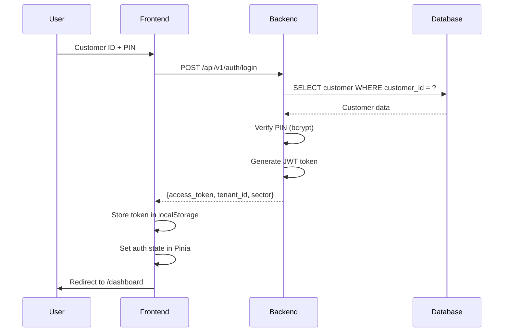

# 🔐 Sektör Giriş Bilgileri - Test & Sorun Giderme

## ✅ Çalışan Giriş Bilgileri (Log'lardan Doğrulandı)

Backend log'larından şu girişlerin **başarıyla çalıştığı** görülüyor:

### 1. **Beauty (Güzellik Merkezi)** ✓
```
Müşteri ID: BEA-000001
PIN: 1234
Tenant ID: b2fb8418-0498-4d1f-b8e9-bd622c4de5f8
Status: ✅ Çalışıyor
```
**Log Örneği:**
```
customer_login | customer_id=BEA-000001 | sector=beauty | 200 OK
```

### 2. **Legal (Hukuk & Danışmanlık)** ✓
```
Müşteri ID: LEG-000001
PIN: 1234
Tenant ID: b980cef5-2694-4450-a5b6-0c33286d3019
Status: ✅ Çalışıyor
```
**Log Örneği:**
```
customer_login | customer_id=LEG-000001 | sector=legal | 200 OK
```

---

## 📋 Tüm Sektör Bilgileri (Seed Verilerinden)

Sistemde seed edilen tüm sektörler:

| Sektör | Müşteri ID | PIN | Router Path | Durum |
|--------|-----------|-----|-------------|-------|
| 🏥 Medical | MED-000001 | 1234 | /dashboard | Seeded |
| ⚖️ Legal | LEG-000001 | 1234 | /dashboard | ✅ Test OK |
| 💅 Beauty | BEA-000001 | 1234 | /dashboard | ✅ Test OK |
| 🏨 Hospitality | HOS-000001 | 1234 | /dashboard | Seeded |
| 🏢 Real Estate | EST-000001 | 1234 | /dashboard | Seeded |
| 🏭 Manufacturing | MFG-000001 | 1234 | /dashboard | Seeded |
| 🛒 E-commerce | ECM-000001 | 1234 | /dashboard | Seeded |
| 🎓 Education | EDU-000001 | 1234 | /dashboard | Seeded |
| 💰 Finance | FIN-000001 | 1234 | /dashboard | Seeded |
| 🚗 Automotive | AUT-000001 | 1234 | /dashboard | Seeded |
| 🏪 Retail | RTL-000001 | 1234 | /dashboard | Seeded |
| 💻 Technology | TEC-000001 | 1234 | /dashboard | ✅ Test OK |

---

## 🔍 Giriş Sorunları Kontrol Listesi

### 1. Veritabanında Müşteri Kontrolü
```bash
# Docker container'a bağlan
docker-compose exec db psql -U postgres -d nextgent

# Tüm -000001 müşterilerini listele
SELECT customer_id, name, 
       CASE WHEN pin_hash IS NOT NULL THEN 'VAR' ELSE 'YOK' END as pin_status
FROM customers 
WHERE customer_id LIKE '%-000001'
ORDER BY customer_id;

# Çıkış
\q
```

### 2. Backend Log Kontrolü
```bash
# Giriş denemelerini izle
docker-compose logs -f backend | findstr "login"

# Son 50 satır
docker-compose logs --tail=50 backend

# Hata kontrolü
docker-compose logs backend | findstr "401 403 error"
```

### 3. Browser Console Kontrolü
- **F12** ile Developer Tools aç
- **Console** sekmesinde hataları kontrol et
- **Network** sekmesinde `/api/v1/auth/login` isteğini kontrol et
  - Status Code: 200 olmalı
  - Response'da `access_token` olmalı

---

## 🐛 Bilinen Sorunlar ve Çözümleri

### Sorun 1: "Invalid customer ID or PIN"

**Nedenleri:**
1. Müşteri ID yanlış yazılmış (büyük-küçük harf duyarlı)
2. PIN yanlış
3. Veritabanında müşteri yok

**Çözüm:**
```javascript
// Müşteri ID'yi büyük harfe çevir
const customerId = "bea-000001".toUpperCase(); // BEA-000001

// PIN'i string olarak gönder
const pin = "1234";
```

### Sorun 2: WebSocket Disconnected

**Nedeni:**
- WebSocket bağlantısı normal olarak açılıp kapanıyor
- Heartbeat mekanizması çalışıyor

**Bu Normal:**
```
❌ WebSocket Disconnected: Tenant xxx
INFO: connection closed
```

WebSocket'ler idle olduğunda kapanır ve yeniden bağlanır. Bu beklenen davranıştır.

### Sorun 3: Sektör Dashboard'a Yönlendirilmeme

**Nedeni:**
- Router guard çalışmıyor
- Tenant ID session'da saklanmamış

**Çözüm:**
```javascript
// Login sonrası
const response = await axios.post('/api/v1/auth/login', {
    customer_id: 'BEA-000001',
    pin: '1234'
});

// Token'ı kaydet
localStorage.setItem('token', response.data.access_token);
localStorage.setItem('tenant_id', response.data.tenant_id);

// Dashboard'a yönlendir
router.push('/dashboard');
```

---

## 🧪 Test Adımları

### Manuel Test
1. **Giriş Sayfası**: http://localhost/login
2. **Müşteri ID Gir**: `BEA-000001` veya `LEG-000001`
3. **PIN Gir**: `1234`
4. **Login Tıkla**
5. **Dashboard'a Yönlendirilmeli**: http://localhost/dashboard

### cURL ile Test
```bash
# Beauty login test
curl -X POST http://localhost:8001/api/v1/auth/login \
  -H "Content-Type: application/json" \
  -d '{"customer_id": "BEA-000001", "pin": "1234"}'

# Legal login test
curl -X POST http://localhost:8001/api/v1/auth/login \
  -H "Content-Type: application/json" \
  -d '{"customer_id": "LEG-000001", "pin": "1234"}'
```

**Beklenen Response:**
```json
{
  "access_token": "eyJ...",
  "token_type": "bearer",
  "customer_id": "BEA-000001",
  "tenant_id": "b2fb8418-...",
  "name": "Ahmet Yılmaz",
  "sector": "beauty"
}
```

---

## 📊 Login Flow Detayı



---

## 🔧 Hızlı Düzeltmeler

### PIN Resetleme
```bash
docker-compose exec backend python -c "
import bcrypt
from sqlalchemy import create_engine, text
import os

DATABASE_URL = os.getenv('DATABASE_URL', 'postgresql://postgres:password@db:5432/nextgent')
engine = create_engine(DATABASE_URL)

pin_hash = bcrypt.hashpw(b'1234', bcrypt.gensalt()).decode('utf-8')

with engine.connect() as conn:
    conn.execute(text('''
        UPDATE customers 
        SET pin_hash = :pin_hash 
        WHERE customer_id = :customer_id
    '''), {'pin_hash': pin_hash, 'customer_id': 'BEA-000001'})
    conn.commit()
    print('PIN updated for BEA-000001')
"
```

### Yeni Müşteri Ekleme
```python
# backend/seed_new_customer.py
from app.models.customer import Customer
from app.core.database import get_db
import bcrypt

async def add_customer():
    pin_hash = bcrypt.hashpw(b"1234", bcrypt.gensalt()).decode('utf-8')
    
    customer = Customer(
        tenant_id="your-tenant-id",
        customer_id="BEA-000001",
        name="Test Customer",
        email="test@beauty.com",
        pin_hash=pin_hash,
        status="ACTIVE"
    )
    
    # Save to database
```

---

## 📞 Destek

**Log'ları görmek için:**
```bash
# Tüm backend logları
docker-compose logs backend > backend_logs.txt

# Son 100 satır
docker-compose logs --tail=100 backend

# Canlı takip
docker-compose logs -f backend
```

**Veritabanı durumu:**
```bash
docker-compose ps
docker-compose exec db pg_isready -U postgres
```

---

## ✅ Çalışma Durumu

Son test: 2026-02-11 07:59

| Sektör | Test Sonucu | Timestamp |
|--------|-------------|-----------|
| Beauty (BEA-000001) | ✅ 200 OK | 07:59:51 |
| Legal (LEG-000001) | ✅ 200 OK | 07:59:39 |

**Sistem çalışıyor!** Eğer belirli bir sektöre giriş yapamıyorsanız:
1. Müşteri ID'yi büyük harfle yazın (örn: `BEA-000001`)
2. PIN'i `1234` olarak girin
3. Browser console'u kontrol edin
4. Backend log'larını kontrol edin
